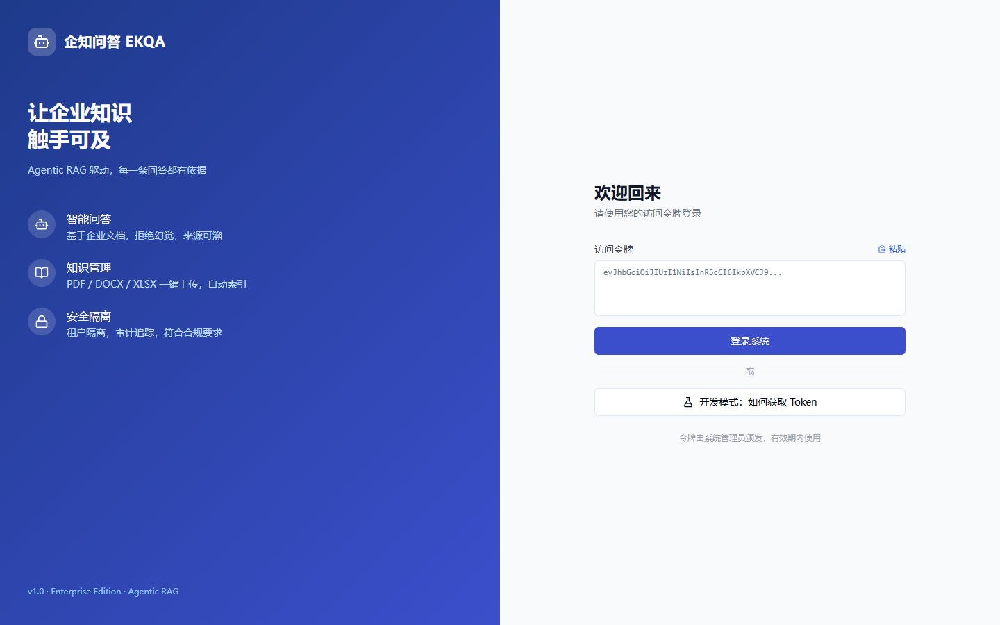
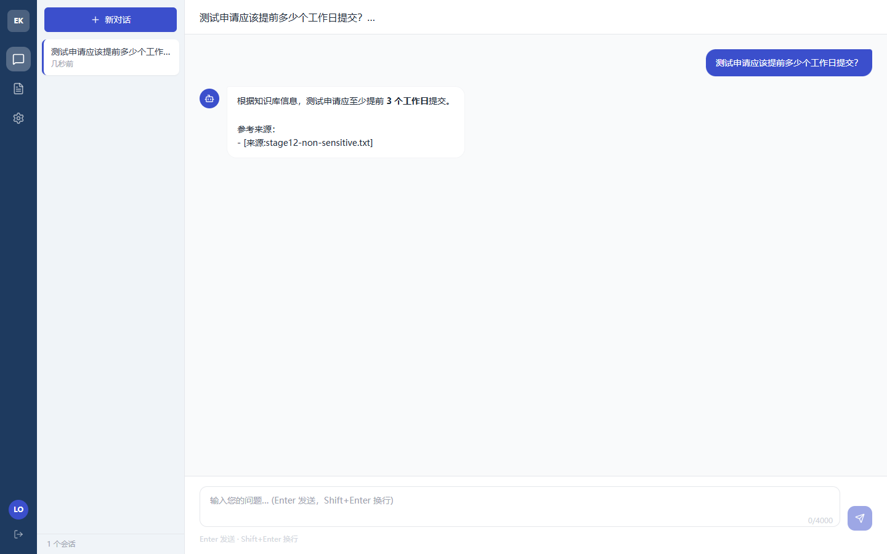
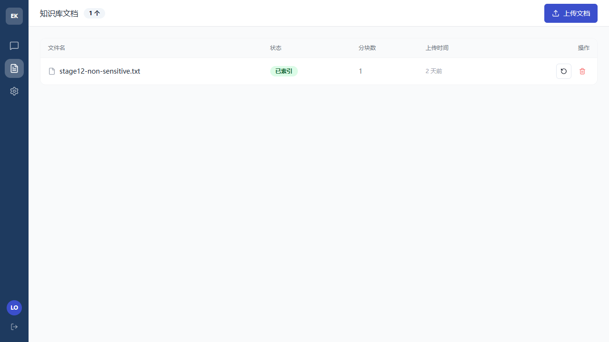
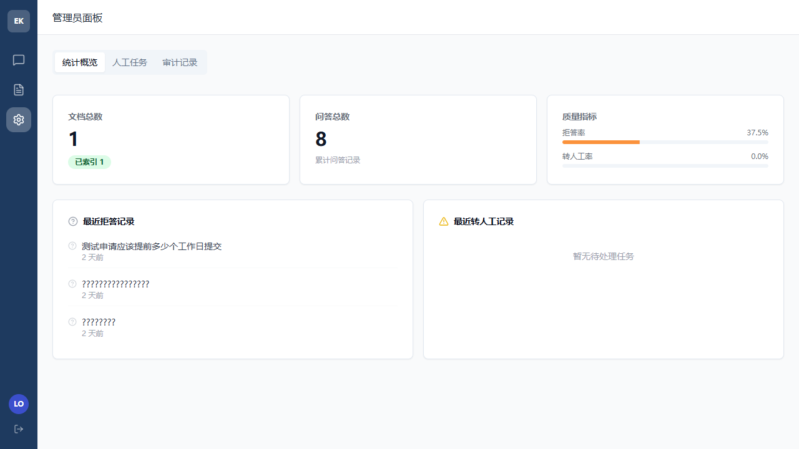

# 企业级 Agentic RAG 知识库

> 基于 **LangChain 1.3 + LangGraph** 的企业知识问答模板，全栈使用**国产大模型**（阿里云百炼）。
> Agentic RAG 参考实现：文档摄入、自主检索问答、可信来源、审计与安全边界。

> **状态说明：生产候选验收已通过。** HARNESS 阶段 0–12 已于 2026-06-23 完成，证据见[阶段 12 验收报告](docs/audit/stage12-acceptance-2026-06-23.md)。这不替代企业 IdP、恶意软件扫描、容量压测、TLS 反向代理和防火墙，未经这些部署控制仍不得直接暴露到局域网或公网。

[](https://github.com/yinxinhai0128/enterprise-ai-knowledge-qa/actions/workflows/ci.yml)

`LangChain 1.3` · `LangGraph` · `FastAPI` · `Chroma` · `React 18` · `阿里云百炼` · `Python 3.12`

---

## 简介

这是一个**可复用的企业知识库模板**。与“先检索再回答”的固定 RAG 流程不同，它把检索封装成工具，由 Agent 判断何时检索；来源与拒答由服务端真实工具状态决定。项目包含 PII 脱敏、长对话摘要、失败重试与自定义审计；部署者仍须完成身份系统、恶意软件扫描、容量压测、外部供应商审批和自身环境的上线变更审批。

## 核心特性

- **🤖 Agentic RAG**：`create_agent` + retriever-as-tool，Agent 自主决定检索时机，而非固定流程。
- **🇨🇳 全国产模型**：LLM 与 Embedding 均经阿里云百炼 OpenAI 兼容接口调用，无需出海。
- **📚 可恢复摄入**：PDF / DOCX / TXT 使用 LangChain Loader，XLSX 使用 OpenPyXL 适配器；持久化 Job 由独立 Worker 租约领取，支持重试、取消、重建与崩溃恢复。
- **🧱 资源安全边界**：请求/并发/每日费用限制，MIME + magic 校验，压缩展开/PDF/XLSX/文本上限，隔离目录与独立解析进程。
- **🛡️ 管控中间件栈**：PII 脱敏、对话摘要、模型重试，外加自定义审计中间件——敏感分类标记转人工、每轮问答落库。
- **🔐 可信身份与租户隔离**：验证企业身份系统签发的 Bearer JWT，按 tenant/user/role 隔离关系数据、会话与向量检索。
- **🧠 持久化多轮记忆**：基于共享 SQLite Checkpointer，按可信 tenant/user/session 隔离，支持跨重启、会话租约、TTL、消息上限与清理。
- **👩‍💼 人工介入闭环**：敏感分类建立可领取、可完成的人工任务，状态变化写入不可变事件；工资、健康、法律数据按角色策略拒绝越权访问。
- **📌 可信溯源**：工具返回 `content + artifact`，API 只用真实 artifact 生成结构化来源；无证据强制拒答，模型自报引用无效。
- **🔍 受治理可观测**：LangSmith 默认关闭，只有组织审批与远端权限/保留策略确认后才能采样开启；问题、工具文档和输出在 SDK 外发前只保留 HMAC/长度。
- **✅ 全 Mock 测试**：不消耗任何真实 API 即可跑通端到端测试。

## 架构图

下图只展示主数据流；完整资产、攻击路径和信任边界见 [威胁模型](docs/THREAT_MODEL.md)。

```
                            ┌─────────────────────────────────────┐
        HTTP (curl/前端)     │              FastAPI                  │
   ─────────────────────────▶  documents · qa · admin · health     │
                            └───────┬───────────────────┬──────────┘
                                    │                   │
                  ┌─────────────────▼──────┐   ┌────────▼─────────────────────┐
                  │   文档摄入 Ingest        │   │   Agentic RAG (create_agent) │
                  │  Loader → Splitter →    │   │  ┌────────────────────────┐  │
                  │  Embedding → 向量入库     │   │  │  Middleware 栈          │  │
                  └───────┬─────────┬───────┘   │  │  PII / 摘要 / 重试 / 审计 │  │
                          │         │           │  └───────────┬────────────┘  │
                          │         │           │   tool: search_knowledge_base │
                          │         │           └────────┬──────────┬──────────┘
                          ▼         ▼                    ▼          │
                  ┌──────────┐  ┌────────────────────────────┐     │
                  │  SQLite  │  │      Chroma 向量库           │◀────┘
                  │ documents│  │   collection: enterprise_kb │
                  │chat_records  └────────────────────────────┘
                  └──────────┘
                          ▲                    ▲             ▲
                          │                    │             │
                  ┌───────┴────────────────────┴─────────────┴───────┐
                  │        阿里云百炼  (LLM + Embedding，OpenAI 兼容)   │
                  └──────────────────────────────────────────────────┘
```

## 前端界面预览

配套 **React 18 + TypeScript + Tailwind CSS + shadcn/ui** 单页应用，已对接全部后端接口，支持移动端响应式布局。

| 登录（Bearer JWT） | 智能问答（来源可溯 + 打字机动效） |
|:---:|:---:|
|  |  |
| **知识库文档（拖拽上传 + 状态轮询）** | **管理员面板（统计 / 人工任务 / 审计）** |
|  |  |

> 技术要点：Agentic RAG 无流式接口，打字机为前端 `setInterval` 模拟；来源引用、拒答、转人工状态均由服务端真实 artifact 驱动，前端不臆造。

## 快速开始

> ⚠️ **务必使用独立虚拟环境**。若本机默认 `python` 指向 Anaconda base，那里通常是旧版 LangChain 0.3.x，缺少 `create_agent`，本项目无法运行。

```powershell
# 1. 进入项目目录
cd 企业级AI知识问答系统

# 2. 确认 Python 版本必须为 3.12+，且不能是 Anaconda 3.9
python --version
# 若这里不是 3.12+，请安装 Python 3.12，并用其完整路径执行下一行，例如：
# & "C:\path\to\Python312\python.exe" -m venv .venv
python -m venv .venv
.\.venv\Scripts\Activate.ps1
# 如果 PowerShell 禁止激活：Set-ExecutionPolicy -Scope Process Bypass

# 3. 安装经哈希锁定的运行依赖
python -m pip install --require-hashes -r requirements.lock

# 4. 配置密钥
Copy-Item .env.example .env     # 仅首次执行，避免覆盖已有密钥
# 编辑 .env，填入真实 DASHSCOPE_API_KEY 和至少 32 字符的随机 AUTH_JWT_SECRET；
# 不用 LangSmith 时保持追踪为 false
# 可选人工验收：python test_connection.py
# 该脚本会真实调用 LLM/Embedding 并可能产生费用，不属于自动化启动前提

# 5. 分别启动 API 与摄入 Worker（两个终端，均先激活 .venv）
uvicorn app.main:app --reload
python -m app.worker
#   打开 http://127.0.0.1:8000/docs 交互式 API 文档

# 6. development 环境获取 15 分钟本地 Token（生产必须从企业 IdP 获取）
$env:TOKEN = python scripts\create_dev_token.py --roles user --ttl-seconds 900
Invoke-RestMethod http://127.0.0.1:8000/health/ready
```

macOS/Linux 请用 `python3.12 -m venv .venv`、`source .venv/bin/activate`，并将 `Copy-Item` 换成 `cp`。

### 启动前端（可选，可视化界面）

```powershell
# 另开终端，进入 frontend 目录
cd frontend
npm install
npm run dev          # 默认 http://localhost:5173

# 生成带 admin 角色的 Token 用于登录（user,admin）
python scripts\create_dev_token.py --roles user,admin --ttl-seconds 3600
```

打开 `http://localhost:5173`，粘贴上面生成的 Token 登录即可。前端默认请求 `http://127.0.0.1:8765`（见 `frontend/.env.development`，需与后端端口一致）。Windows 用户也可直接运行根目录 `start.ps1` 一键拉起后端 + Worker + 前端三个窗口。

容器化部署：`docker compose up -d --build`（已挂载 `storage` / `chroma_db` / `logs` 卷）。镜像以 UID/GID 10001 非 root 身份和只读根文件系统运行，源码由 root 拥有且不可修改。

> ⚠️ Compose 默认只监听 `127.0.0.1`。JWT 验证不等于完成全部生产加固；在 HARNESS 阶段 12 最终验收前仍禁止将 8000 端口直接暴露到局域网或公网。
>
> 生产环境请设置 `APP_ENV=production`，此时 `/docs`、`/redoc` 与 `/openapi.json` 默认关闭。
>
> **禁止启动或暴露 Chroma HTTP Server**：当前 `chromadb==1.5.9` 尚无 `CVE-2026-45829` 修复版，本项目仅允许嵌入式持久化用法。补偿控制、到期日、升级和迁移方案见 [`docs/SUPPLY_CHAIN_AND_CHROMA_SECURITY.md`](docs/SUPPLY_CHAIN_AND_CHROMA_SECURITY.md)。

## 技术选型说明

| 组件 | 选型 | 理由 |
|---|---|---|
| Agent 框架 | LangChain **1.3** + LangGraph | 1.3 的 `create_agent` 是官方推荐写法；LangGraph 提供检查点与状态图运行时 |
| LLM / Embedding | 阿里云百炼（OpenAI 兼容） | 当前实现统一走兼容端点；模型 ID 与账号权限必须实测 |
| 向量库 | Chroma（`langchain-chroma`） | 轻量、本地可跑；适合单机模板和经容量验证的中小规模场景 |
| Web 框架 | FastAPI + Uvicorn | 原生 async、自动生成 OpenAPI 文档 |
| 关系存储 | SQLite + SQLAlchemy 2.0（async）| 降低本地启动门槛；切换 PostgreSQL 需要迁移设计与回归，不能视为无改动切换 |
| 配置 | pydantic-settings | `.env` 强类型校验，杜绝硬编码密钥 |
| 文档解析 | LangChain Loader + OpenPyXL | PDF/DOCX/TXT 使用生态 Loader；XLSX 采用轻量适配器，避免引入重型 OCR 依赖 |

## 项目结构

```
企业级AI知识问答系统/
├── app/
│   ├── main.py                 # FastAPI 入口、lifespan、路由注册
│   ├── config.py               # pydantic-settings 配置单例
│   ├── core/
│   │   ├── llm.py              # init_llm / init_embeddings（走百炼）
│   │   ├── vectorstore.py      # get_vectorstore（Chroma 单例）
│   │   ├── retriever_tool.py   # @tool search_knowledge_base
│   │   ├── limits.py           # 速率/并发限制与每日模型预算
│   │   ├── process_pool.py     # 可超时并终止的不可信解析进程
│   │   ├── checkpointer.py     # 持久化会话连接生命周期
│   │   ├── observability.py    # 安全日志、request ID、指标和模型超时
│   │   └── database.py         # 异步引擎 / 会话 / Base / init_db
│   ├── agent/
│   │   ├── agent.py            # build_agent（create_agent 单例）
│   │   └── middleware.py       # EnterpriseAuditMiddleware + 自定义状态
│   ├── services/
│   │   ├── file_security.py    # MIME/magic/展开限制/扫描器接口
│   │   ├── ingest.py           # 隔离解析→Splitter→向量入库
│   │   ├── ingest_jobs.py      # Job 租约、重试、崩溃恢复与补偿
│   │   ├── conversations.py    # 会话租约、TTL、消息裁剪与清理
│   │   ├── audit.py            # 预登记、重试与 fail-closed 审计
│   │   ├── sensitive_policy.py # 版本化分类与角色访问策略
│   │   ├── health.py           # live/ready 组件探针
│   │   └── consistency.py      # SQLite/文件/Chroma 一致性巡检
│   ├── worker.py               # 独立摄入 Worker 入口
│   ├── models/                 # SQLAlchemy 模型（含 ingest_job）
│   ├── schemas/                # Pydantic 出入参
│   └── api/                    # 路由：documents / qa / admin
├── tests/                      # 全 Mock 测试（pytest）
├── scripts/                    # 审计、备份恢复、development Token 工具
├── docs/                       # 部署、威胁模型、治理和运维文档
├── test_connection.py          # 连通性自检脚本
├── requirements.txt            # 运行依赖
├── requirements.lock           # 完整运行依赖 + SHA-256 哈希
├── requirements-dev.txt        # 测试依赖
├── Dockerfile / docker-compose.yml
└── .env.example
```

## 环境变量说明

复制 `.env.example` 为 `.env` 后填写：

| 变量 | 必填 | 说明 |
|---|:--:|---|
| `DASHSCOPE_API_KEY` | ✅ | 百炼 API Key（[控制台获取](https://bailian.console.aliyun.com/)）|
| `DASHSCOPE_BASE_URL` | | 百炼 OpenAI 兼容地址，默认 `https://dashscope.aliyuncs.com/compatible-mode/v1` |
| `LLM_MODEL` | | 对话模型，默认 `qwen3.6-plus`；必须使用百炼控制台显示的精确模型 ID（区分大小写）|
| `EMBED_MODEL` | | 向量模型，默认 `text-embedding-v3` |
| `LLM_MAX_OUTPUT_TOKENS` | | 单次模型输出上限，默认 2048 |
| `AGENT_MAX_STEPS` | | 单次 Agent 图节点上限，默认 30 |
| `MAX_MODEL_CALLS_PER_REQUEST` | | 单请求模型调用上限，默认 4 |
| `MAX_RETRIEVAL_CALLS_PER_REQUEST` | | 单请求知识库检索上限，默认 3 |
| `LLM_INPUT_COST_PER_MILLION` / `LLM_OUTPUT_COST_PER_MILLION` | | 供应商账单币种的每百万 Token 单价；默认 0，仅统计 Token |
| `LANGSMITH_API_KEY` | | LangSmith 密钥，留空则不上报 |
| `LANGCHAIN_TRACING_V2` | | 是否开启链路追踪，`true` / `false` |
| `LANGCHAIN_PROJECT` | | LangSmith 项目名，默认 `enterprise-kb` |
| `LANGSMITH_ORG_APPROVED` / `LANGSMITH_APPROVAL_REFERENCE` | | 组织审批开关 / 工单或决策编号；默认未审批 |
| `LANGSMITH_REMOTE_POLICY_CONFIRMED` | | 是否已在远端确认最小权限和保留策略；默认 `false` |
| `LANGSMITH_TRACING_SAMPLING_RATE` | | 根 trace 采样率，默认 `0.0`；启用时必须大于 0 |
| `LANGSMITH_WORKSPACE_ID` / `LANGSMITH_ENDPOINT` / `LANGSMITH_DATA_REGION` | | 获批工作区、HTTPS 端点和驻留区域；默认禁用 |
| `LANGSMITH_RETENTION_DAYS` | | 经审批并在远端配置的保留天数，默认 14 |
| `LANGSMITH_REDACTION_SECRET` | ✅* | 追踪开启时必填的独立 HMAC 密钥，至少 32 个随机字符 |
| `DATABASE_URL` | | 异步数据库连接串，默认 SQLite（`storage/app.db`）|
| `APP_ENV` | | `development` / `production`；生产模式关闭 API 文档路由 |
| `APP_HOST` / `APP_PORT` | | 服务监听地址 / 端口，默认 `127.0.0.1:8000` |
| `LOG_LEVEL` | | 日志级别，默认 `INFO` |
| `READINESS_TIMEOUT_SECONDS` | | SQLite、Chroma、Worker 租约单组件就绪检查超时，默认 3 秒 |
| `AUTH_JWT_SECRET` | ✅ | HS256 验签密钥，至少 32 个随机字符；不得使用示例值 |
| `AUTH_JWT_ISSUER` | | 可信签发方，默认 `enterprise-idp` |
| `AUTH_JWT_AUDIENCE` | | 本服务 audience，默认 `enterprise-kb` |
| `MAX_QUESTION_CHARS` / `MAX_SESSION_ID_CHARS` | | 问题/会话标识字符上限，默认 4000 / 64 |
| `QA_RATE_LIMIT_PER_MINUTE` / `QA_MAX_CONCURRENCY` | | 单身份 QA 每分钟/并发上限，默认 30 / 8 |
| `UPLOAD_RATE_LIMIT_PER_MINUTE` / `UPLOAD_MAX_CONCURRENCY` | | 单身份上传每分钟/并发上限，默认 10 / 2 |
| `ADMIN_RATE_LIMIT_PER_MINUTE` / `ADMIN_MAX_CONCURRENCY` | | 单身份管理请求每分钟/并发上限，默认 60 / 10 |
| `DAILY_USER_MODEL_CALLS` / `DAILY_TENANT_MODEL_CALLS` | | 用户/租户每日模型调用预留上限，默认 200 / 5000 |
| `DAILY_USER_TOKEN_BUDGET` / `DAILY_TENANT_TOKEN_BUDGET` | | 用户/租户每日 Token 预算，默认 500000 / 10000000 |
| `MAX_FILENAME_CHARS` / `MAX_FILE_SIZE_BYTES` | | 文件名字符/文件字节上限，默认 200 / 52428800 |
| `UPLOAD_CHUNK_BYTES` / `UPLOAD_WRITE_TIMEOUT_SECONDS` | | 流式写块大小/写入超时，默认 1048576 / 30 秒 |
| `FILE_VALIDATION_TIMEOUT_SECONDS` / `PARSER_TIMEOUT_SECONDS` | | 文件安全校验/解析超时，默认 30 / 120 秒 |
| `PARSER_WORKERS` | | 独立解析进程数，默认 2 |
| `INGEST_JOB_MAX_ATTEMPTS` / `INGEST_JOB_LEASE_SECONDS` | | 摄入最大尝试次数 / Worker 租约秒数，默认 3 / 300 |
| `INGEST_JOB_POLL_SECONDS` / `INGEST_JOB_RETRY_BASE_SECONDS` | | Worker 轮询间隔 / 指数退避基数，默认 2 / 30 秒 |
| `INGEST_WORKER_CONCURRENCY` | | 单 Worker 进程并发槽位，默认 1 |
| `CHECKPOINT_DB_PATH` | | LangGraph 持久化 checkpoint 文件，默认 `storage/checkpoints.db` |
| `CONVERSATION_TTL_DAYS` / `CONVERSATION_MAX_MESSAGES` | | 会话有效期 / checkpoint 最大消息数，默认 30 天 / 100 |
| `CONVERSATION_LEASE_SECONDS` / `CONVERSATION_CLEANUP_BATCH` | | 同会话跨 Worker 租约 / 单次清理上限，默认 300 秒 / 200 |
| `AUDIT_WRITE_RETRIES` | | 审计事务失败后的重试次数，默认 3；最终失败时响应 fail-closed |
| `SENSITIVE_RULES_PATH` | | 版本化敏感分类与访问规则文件，默认 `config/sensitive_rules.json` |
| `MAX_ARCHIVE_ENTRIES` | | Office 压缩包条目上限，默认 2000 |
| `MAX_ARCHIVE_UNCOMPRESSED_BYTES` / `MAX_ARCHIVE_COMPRESSION_RATIO` | | 展开字节/压缩比上限，默认 104857600 / 100 |
| `MAX_PDF_PAGES` | | PDF 页数上限，默认 500 |
| `MAX_XLSX_SHEETS` / `MAX_XLSX_CELLS` | | 工作表/单元格上限，默认 100 / 1000000 |
| `MAX_PARSED_CHARS` | | 单文档解析文本字符上限，默认 2000000 |
| `MALWARE_SCAN_REQUIRED` | | 是否要求外部恶意软件扫描器成功，生产接入后设为 `true` |

## 身份认证与租户模型

除 `/health`、`/health/live`、`/health/ready`、`/metrics` 外，业务接口都要求 `Authorization: Bearer <token>`。生产 Token 必须由外部企业身份系统签发；本服务只验证、不提供生产 Token 签发接口。当前固定使用 HS256，并校验签名、`iss`、`aud`、`exp`、`iat` 及以下 claims：

```json
{
  "sub": "user-123",
  "tenant_id": "tenant-a",
  "roles": ["user"],
  "iss": "enterprise-idp",
  "aud": "enterprise-kb",
  "iat": 1735689600,
  "exp": 1735693200
}
```

- 文档和问答路由需要 `user` 角色；管理路由需要 `admin` 角色。
- `user_id`、`tenant_id` 和角色只取自已验签 claims，请求体中的同名字段不会改变身份。
- Agent thread ID 由服务端生成：`tenant_id:user_id:session_id`。
- 旧版本数据迁移到受控的 `legacy` 租户；只有持有该 tenant claim 的已签名 Token 才能访问。
- 本地开发可使用 `scripts/create_dev_token.py`；它在非 `development` 环境拒绝运行。详细获取与轮换流程见 [部署手册](docs/DEPLOYMENT.md)。

## 可信证据与拒答

检索工具的 `content` 只供模型阅读，`artifact` 才是服务端认可的证据。每条 `sources` 都包含 `doc_id`、稳定的 `chunk_id`、`source`、`page/sheet_name`、`distance` 和 `relevance`。

- API 不从模型回答文本中解析来源。
- 模型未调用工具或工具无命中时，服务端强制 `refused=true`。
- 模型生成的来源标注会被清除，再由真实 artifact 重建展示引用。
- 文档片段使用 `UNTRUSTED_DOCUMENT_CONTENT` 边界传给模型；文档中的提示、角色或工具指令一律视为不可信数据。
- `refused`、`has_source` 与 evidence 均为结构化状态，管理统计直接读取数据库字段。

## 会话、审计与分类访问策略

- 每次问答使用 `tenant:user:session` 作为 checkpoint thread，并通过 `conversation_sessions` 租约串行化同一会话；不同 API Worker 共享 `CHECKPOINT_DB_PATH`。
- 会话超过 `CONVERSATION_TTL_DAYS` 后读取立即失效；启动时或执行 `python -m app.commands.cleanup_sessions` 会删除关系目录和 checkpoint。消息超过配置上限时只保留最新消息。
- 问答在调用 Agent 前先写 `pending` 审计；完成事务记录 tool/sources/trace/model/tokens/latency。写入会重试，最终失败返回 503，不向客户端交付未审计回答；`GET /admin/audits/pending` 可观测待补偿记录。
- `config/sensitive_rules.json` 使用版本号和正则分类，避免简单子串匹配。工资/健康/法律分类分别要求 `hr` / `legal` / `admin` 等可信 JWT 角色；无权访问返回 403，同时创建人工任务。
- 人工任务状态为 `pending → claimed → completed`，领取和完成均受租户与处理人约束，每次变化写入 `human_task_events`。

## LangSmith 数据治理

- `LANGCHAIN_TRACING_V2=false` 是开发和生产默认值。单独改成 `true` 不会开启追踪；审批、远端策略确认、工作区、HTTPS 端点、驻留区域、采样率和独立 HMAC 密钥必须同时有效。
- 未通过治理门时只拒绝外部追踪，知识库继续运行，并在 `trace_governance_events` 记录 `denied`；通过时记录 `approved`，但不会保存 API Key 或脱敏密钥。
- 所有 run 输入/输出中的字符串在 LangSmith Client 发送前替换为带密钥 HMAC 与长度；工具结果不发送文档原文，附件、事件内容、运行时环境和序列化清单不外发，metadata 只保留固定技术白名单。
- 详细的数据清单、项目权限、数据驻留、供应商协议、保留与删除操作见 [LangSmith 数据治理](docs/LANGSMITH_DATA_GOVERNANCE.md)。

## 资源与上传安全

- 所有上传先进入 `storage/quarantine/{tenant}`；MIME、magic、结构、资源与恶意软件检查通过且解析成功后，才移动到 `storage/documents/{tenant}`。
- PDF、DOCX、XLSX、TXT 分别执行页数、压缩展开、工作表/单元格、UTF-8 与文本量校验；失败响应不会包含服务器绝对路径或内部堆栈。
- 上传 API 只保存文件，并在同一数据库事务中创建 `documents` 与 `ingest_jobs`；独立 Worker 使用超时租约领取任务，因此 API 或 Worker 重启不会丢任务。
- 文档解析在独立 `ProcessPoolExecutor` 中运行并受超时控制。文件字节 SHA-256 用作租户内幂等键，chunk 使用稳定 ID；向量或数据库提交失败时会补偿清理，避免错误标记为 `indexed`。
- `python -m app.commands.check_consistency` 可只读巡检 SQLite、文件与 Chroma 的缺失/孤儿记录；返回码 0 表示一致。
- `MalwareScanner` 是可替换接口。默认扫描器仅用于开发；生产接入 ClamAV/EDR 后调用 `configure_malware_scanner(...)` 并设置 `MALWARE_SCAN_REQUIRED=true`。
- 分钟速率与并发限制按 `tenant:user` 在单 API 进程内执行；当前 Docker 默认单进程。每日模型调用与 Token 预算写入 SQLite，可跨重启生效。
- Token 预算在模型调用前按“问题估算 + 每次最大输出 × 单请求最大模型次数”保守预留；即使模型供应商未返回 usage metadata，也不会低估费用上界。

## API 文档

development 环境的交互文档见 `http://127.0.0.1:8000/docs`；production 环境该路由关闭。完整方法/路径/角色矩阵见 [部署手册](docs/DEPLOYMENT.md)，常用接口如下：

**上传文档**（异步索引，仅 pdf/docx/xlsx/txt，≤50MB）
```bash
curl -X POST http://127.0.0.1:8000/documents/upload -H "Authorization: Bearer $TOKEN" -F "file=@手册.pdf"
```

**文档列表 / 详情**（查看索引状态与切片数）
```bash
curl -H "Authorization: Bearer $TOKEN" http://127.0.0.1:8000/documents
curl -H "Authorization: Bearer $TOKEN" http://127.0.0.1:8000/documents/1
```

**摄入任务管理 / 删除**
```bash
curl -H "Authorization: Bearer $TOKEN" http://127.0.0.1:8000/documents/1/jobs
curl -X POST -H "Authorization: Bearer $TOKEN" http://127.0.0.1:8000/documents/1/retry
curl -X POST -H "Authorization: Bearer $TOKEN" http://127.0.0.1:8000/documents/1/cancel
curl -X POST -H "Authorization: Bearer $TOKEN" http://127.0.0.1:8000/documents/1/reindex
curl -X DELETE -H "Authorization: Bearer $TOKEN" http://127.0.0.1:8000/documents/1
```

**提问**（同一 `session_id` 自动带多轮记忆）
```powershell
Invoke-RestMethod -Uri http://127.0.0.1:8000/qa/ask -Method Post -Headers @{Authorization="Bearer $env:TOKEN"} -ContentType "application/json" -Body '{"question":"报销流程是什么？","session_id":"s1"}'
# 返回: {"answer":"...","sources":[{"doc_id":1,"chunk_id":"...","source":"手册.pdf","page":2,"sheet_name":null,"distance":0.2,"relevance":0.8333}],"refused":false,"need_human":false}
```

**会话历史**
```bash
curl -H "Authorization: Bearer $TOKEN" http://127.0.0.1:8000/qa/history/s1
```

**管理看板**（统计 / 拒答列表 / 转人工列表）
```bash
curl -H "Authorization: Bearer $ADMIN_TOKEN" http://127.0.0.1:8000/admin/stats
curl -H "Authorization: Bearer $ADMIN_TOKEN" http://127.0.0.1:8000/admin/refused
curl -H "Authorization: Bearer $ADMIN_TOKEN" http://127.0.0.1:8000/admin/human
curl -H "Authorization: Bearer $ADMIN_TOKEN" http://127.0.0.1:8000/admin/human-tasks?status=pending
curl -X POST -H "Authorization: Bearer $ADMIN_TOKEN" http://127.0.0.1:8000/admin/human-tasks/1/claim
curl -X POST -H "Authorization: Bearer $ADMIN_TOKEN" -H "Content-Type: application/json" -d '{"resolution":"已处理"}' http://127.0.0.1:8000/admin/human-tasks/1/complete
curl -H "Authorization: Bearer $ADMIN_TOKEN" http://127.0.0.1:8000/admin/human-tasks/1/events
curl -H "Authorization: Bearer $ADMIN_TOKEN" http://127.0.0.1:8000/admin/audits/pending
```

## 运维与恢复

- `/health/live` 只检查进程存活；`/health/ready` 检查 SQLite、Chroma 与 Worker 租约且不调用模型；Docker healthcheck 使用 readiness。
- `/metrics` 导出 Prometheus 文本：请求量/延迟、拒答/人工、摄入失败/积压、Token/费用、重试和超时。所有标签均为低基数聚合，不含问题、文档、用户或租户。
- JSON 日志使用 `X-Request-ID` 关联；错误响应带稳定 `error_code` 与 `request_id`。日志 patcher 会移除已知密钥、Bearer Token 和异常原文。
- 告警阈值位于 `config/alerts.yml`，排障、备份、空目录恢复和回滚流程见 [运维 Runbook](docs/OPERATIONS_RUNBOOK.md)。

维护窗口备份和恢复演练：

```powershell
.\.venv\Scripts\python.exe scripts\backup_restore.py backup --destination backups\stage10_YYYYMMDD_HHMMSS --maintenance-confirmed
.\.venv\Scripts\python.exe scripts\backup_restore.py restore --backup backups\stage10_YYYYMMDD_HHMMSS --target-root $env:TEMP\enterprise_kb_restore_drill
.\.venv\Scripts\python.exe scripts\backup_restore.py verify --root $env:TEMP\enterprise_kb_restore_drill
```

恢复工具拒绝非空目标且不会覆盖正式数据；只有 `total_issues=0` 才允许进入人工审批的正式切换。

## 安全与部署文档

- [安全部署与三套配置](docs/DEPLOYMENT.md)：从零启动、Token 获取、API 角色、迁移、Key 轮换、容量边界。
- [威胁模型](docs/THREAT_MODEL.md)：资产、数据流、信任边界、六类核心攻击与剩余风险。
- [运维 Runbook](docs/OPERATIONS_RUNBOOK.md)：告警、排障、备份恢复与回滚。
- [LangSmith 数据治理](docs/LANGSMITH_DATA_GOVERNANCE.md)：外部追踪审批、脱敏、驻留、保留和删除。
- [供应链与 Chroma 风险](docs/SUPPLY_CHAIN_AND_CHROMA_SECURITY.md)：依赖/镜像审计与风险接受期限。

已知限制包括单机 SQLite/嵌入式 Chroma、进程内分钟限流、无 OCR/JWKS/Alembic、默认扫描器不可用于生产、备份需短暂停写。完整边界以部署手册为准。

## 扩展指南

### 更换大模型 / 向量模型

百炼接口与 OpenAI 兼容，**换百炼内任意模型只改 `.env`**，无需动代码：

```dotenv
LLM_MODEL=qwen3.6-plus       # 换成百炼控制台中当前账号可用的精确模型 ID
EMBED_MODEL=text-embedding-v3
```

若要切换到**其它厂商**（如 OpenAI、智谱），只需在 `app/core/llm.py` 调整 `base_url` 与 `api_key` 来源；其余代码因面向 LangChain 抽象编程而无需改动。

### 更换向量库

检索逻辑全部依赖 `get_vectorstore()` 返回的 LangChain `VectorStore` 抽象。换 Chroma 为 PGVector / Milvus / Qdrant，**只改 `app/core/vectorstore.py` 一处**：

```python
# app/core/vectorstore.py
from langchain_postgres import PGVector

@lru_cache(maxsize=1)
def get_vectorstore():
    return PGVector(
        collection_name="enterprise_kb",
        embeddings=init_embeddings(),
        connection=settings.database_url,
    )
```

`retriever_tool.py`、`ingest.py`、Agent 均无需改动。

> 💡 距离阈值 `MAX_DISTANCE`（`retriever_tool.py`）与具体 embedding/度量强相关，更换模型或向量库后请按真实数据重新调优。

## 路线图

- [x] 项目骨架、配置、容器化
- [x] 文档摄入管道（多格式、异步索引）
- [x] Agentic RAG 核心（检索工具 + 中间件栈）
- [x] 问答 / 历史 / 管理接口
- [x] 全 Mock 自动化测试
- [x] 持久化 Checkpointer、会话 TTL/消息边界与跨 Worker 租约
- [x] 可靠审计、分类访问策略与人工任务状态流
- [x] 流式输出（SSE `/qa/stream` 真流式逐字 + 末尾结构化来源；`/qa/ask` 完整 JSON 兜底，审计 fail-closed 语义不变）
- [x] 持久化摄入任务、崩溃恢复与三存储一致性
- [x] 文档删除与向量库同步清理
- [x] JWT 鉴权、角色授权与租户隔离
- [x] 结构化检索证据、稳定 chunk ID 与服务端强制拒答
- [x] 输入、上传、解析、并发与每日费用安全边界
- [ ] 检索增强：重排（Rerank）、混合检索、引用高亮
- [x] 前端管理台（React + TS + Tailwind，问答 / 文档 / 管理三大模块，移动端适配）

## 测试

```bash
python -m pip install --require-hashes -r requirements.lock
python -m pip install -r requirements-dev.txt
python -m ruff check app tests scripts
python -m mypy
python scripts/secret_scan.py
python scripts/dependency_audit.py
python -m pytest -q
python scripts/check_test_cleanup.py
```

全程使用 Mock（假模型 / 确定性假向量 / 内存 Chroma / 临时库），**不消耗任何真实 API**。

---

> 本项目是学习与生产候选模板；采用前仍须完成自身数据分类、容量验证、安全评审和上线变更审批。
