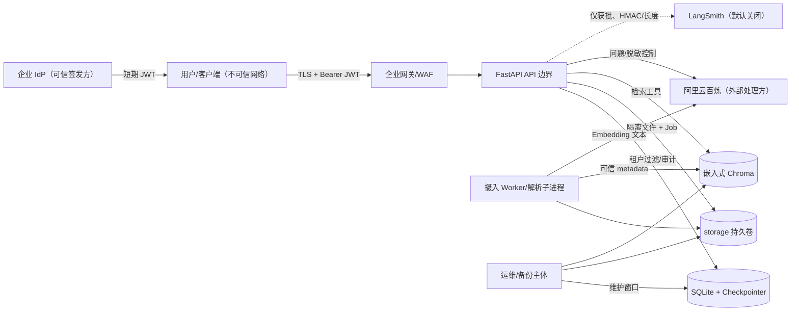

# 威胁模型

> 版本范围：当前 `hardening/production-readiness` 实现。最终生产接受仍取决于 HARNESS 阶段 12。

## 1. 资产与安全目标

核心资产包括企业文档原件、向量与元数据、问题/答案/会话、人工任务、身份 claims、模型及 LangSmith Key、JWT Secret、审计记录和备份。目标是：机密性、租户隔离、来源可信、审计完整、服务可用、费用可控、故障可恢复。

不可信输入包括 HTTP 请求、JWT 字符串、用户问题、上传文件、文档正文中的指令、模型生成文本、外部模型响应和供应商可观测平台。

## 2. 数据流与信任边界

边界说明：

1. **网络边界**：8000 默认仅本机绑定；生产由 TLS 网关接入。JWT 不替代网络隔离。
2. **身份边界**：只有验签后的 `sub/tenant_id/roles` 可信；请求体字段不可信。
3. **文件边界**：上传先隔离，解析在独立进程；文档正文永远是不可信数据。
4. **模型边界**：百炼与 LangSmith 是外部处理方；模型输出不能决定身份、来源或审计状态。
5. **存储边界**：SQLite、文件、Chroma 必须同租户过滤、同时间点备份和一致性检查。

## 3. 主要威胁

| 威胁 | 典型攻击 | 已实现控制 | 剩余风险/动作 |
|---|---|---|---|
| 匿名访问 | 扫描 API、直接上传/提问 | 宿主只绑定本机；业务路由 Bearer JWT；生产关闭 OpenAPI；401/错误码审计 | `/health*`、`/metrics` 为匿名聚合端点，必须由防火墙/监控网络保护 |
| 越权与跨租户 | 伪造 `user_id/tenant_id`、枚举文档/会话/人工任务 | HS256 验签并要求 iss/aud/exp/iat；身份只取 claims；所有 SQL/向量/thread 带 tenant/user；角色依赖 | 单一共享 Secret、无 JWKS/撤销列表；生产前规划非对称签名和双 Key 轮换 |
| 提示词注入/伪造来源 | 文档要求忽略系统提示，模型自行编造 `[来源:]` | 文档包在 `UNTRUSTED_DOCUMENT_CONTENT`；来源只取 tool artifact；模型引用会被删除重建；无 evidence 强制拒答 | 模型仍可能生成错误摘要；需人工抽检、评估集和后续 rerank/事实一致性评测 |
| 恶意文件 | 伪造 MIME、压缩炸弹、超大 PDF/XLSX、解析器漏洞 | 扩展名/MIME/magic/结构校验；展开、页/表/格/字符上限；隔离目录；独立解析进程、超时和硬终止 | 默认扫描器不是生产反恶意软件；需接入 ClamAV/EDR、沙箱与供应链补丁流程 |
| 数据外传 | Key/Token/问题/文档进入日志、LangSmith 或错误响应 | `.env`/数据不入 Git/镜像；JSON 日志脱敏且不记正文；LangSmith 默认关闭、治理门、HMAC/长度；安全错误响应 | 百炼仍需处理问题和 embedding 文本；必须有合同/区域/训练用途审批及最小化数据策略 |
| 费用与资源攻击 | 高频请求、长问题、Agent 循环、上传耗尽 CPU/磁盘 | 速率/并发、每日模型调用与 Token 预算、模型/工具调用上限、上传/解析边界、队列和告警 | 分钟限流是进程内；多副本需共享限流，磁盘配额和供应商账单告警仍由平台配置 |
| 持久化与恢复破坏 | SQLite/Chroma 不同时间点、孤儿文件、备份篡改 | 租约/重试/补偿、一致性巡检；维护窗口联合备份、SHA-256 清单、SQLite integrity、空目录恢复 | 无在线一致快照/远程备份编排；需定期离线演练和备份访问控制 |
| 供应链/容器逃逸 | 恶意依赖、已知 CVE、容器写源码 | 哈希锁、依赖/镜像审计、固定基础镜像 digest、非 root、只读根、drop capabilities | Chroma 已登记风险接受有期限；上游修复后必须升级并撤销例外 |

## 4. 关键安全不变量

- 未验签身份不能进入业务路由；缺少角色为 403，而不是由客户端自行声明。
- 查询必须包含可信 tenant；thread ID 必须由服务端组合 tenant/user/session。
- `answer` 中的引用不构成证据；只有当前工具回合的结构化 artifact 可生成 `sources`。
- 审计最终写入失败时不交付回答（fail-closed）。
- 自动化测试禁止真实模型、LangSmith 和非 loopback 网络。
- 备份/恢复工具不复制 `.env`，不覆盖非空目标，不删除正式数据。

## 5. 验证映射

| 控制 | 主要自动化证据 |
|---|---|
| 认证/角色/租户隔离 | `tests/test_auth.py`、`tests/test_agent.py` |
| 提示词注入/可信来源/拒答 | `tests/test_agent.py`、`tests/test_api.py` |
| 文件与资源攻击 | `tests/test_ingest.py`、`tests/test_limits.py` |
| 会话/审计/人工任务 | `tests/test_persistence.py` |
| 任务恢复/一致性 | `tests/test_ingest_jobs.py` |
| 外部追踪治理 | `tests/test_tracing.py`、`tests/test_network_isolation.py` |
| 健康、日志、超时告警 | `tests/test_observability.py` |
| 备份恢复 | `tests/test_backup_restore.py` |
| 容器与供应链 | `tests/test_container_security.py`、审计脚本 |

## 6. 复核触发条件

身份算法、模型/供应商、LangSmith 区域、向量库、文件解析器、数据库、网络暴露、数据分类、备份位置或部署拓扑发生变化时必须更新本模型；每次生产发布和至少每季度复核一次剩余风险、风险接受到期日与告警阈值。
